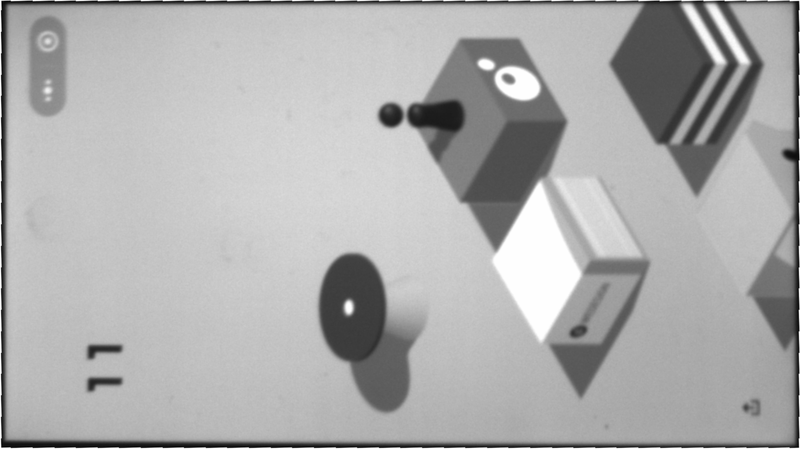
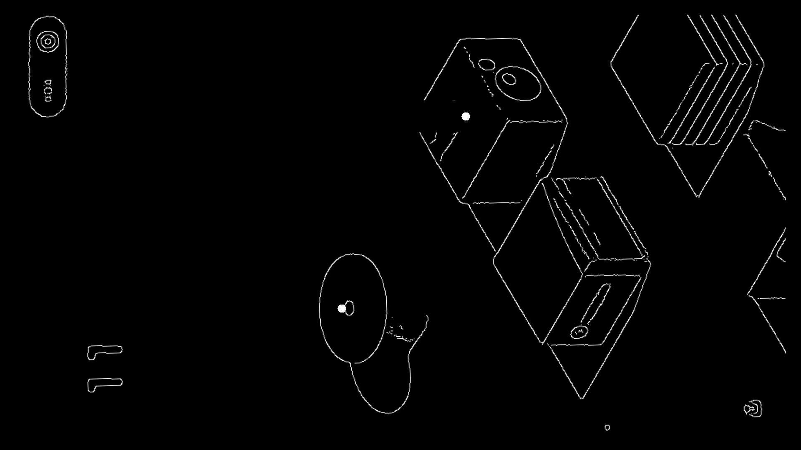

# HOW TO USE
## 安装SDK
1. 安装JAI相机SDK
2. DOBOT机械臂SDK
3. `pip3 install PyQt5,opencv`

## 运行相机拍摄程序
先`cd 1-AsyncImageRecordingSample/bin/Release/`后运行`AsyncImageRecordingSample.exe`开始相机的拍摄，界面使用部分见 [camera.md](https://github.com/Jarvis-K/wechat_jump/blob/master/camera.md)

## 运行识别与操作程序
`python AllForOne.py`运行程序，界面如下


在框中填入手机的分辨率，然后点击`play`开始`stop`停止。


# 代码逻辑
# 相机代码
见 [camera.md](https://github.com/Jarvis-K/wechat_jump/blob/master/camera.md)
# 识别代码
## 载入待识别图片与模版
载入棋子，结束以及白点的模版：

```python
# Load Template For player,end,and withe circle.
temp1 = cv2.imread('temp_player.jpg', 0)
temp_end = cv2.imread('temp_end.jpg', 0)
temp_white_circle = cv2.imread('temp_white_circle.jpg', 0)
```

载入并旋转图片：

```python
 img_rgb = cv2.imread('phone.png', 0)
img_rgb = np.transpose(img_rgb);
img_rgb = cv2.flip(img_rgb, 0);
```
判断游戏是否结束：

```python
# judge if game is over
            res_end = cv2.matchTemplate(img_rgb, temp_end, cv2.TM_CCOEFF_NORMED)
            if cv2.minMaxLoc(res_end)[1] > 0.8:
                print('Game over!')
                break
```
## 获取屏幕
由于我们使用相机拍摄手机，所以第一步就要先获取手机屏幕部分的图片。具体代码参见`play.py`中的`getScreen()`，流程大致如下：

1. 先进行双边滤波降噪`cv2.bilateralFilter(img_rgb,7, 80, 80)`
2. 然后canny边缘检测 `cv2.Canny(img_rgb, 10, 28)`
3. 再进行一次高斯模糊（将断开的线连到一起）`cv2.GaussianBlur(img_rgb, (9,13), 0)`
4. 使用findContours找到轮廓，
5. 把其中形成的多边形面积最大的轮廓作为手机屏幕轮廓，
6. 再通过寻找轮廓点的左上，左下，左下，右下四个点，找到矩形端点，
7. 通过透视变换转成一个750x1334分辨率的屏幕`cv2.warpPerspective(canny_img, M, (1080, 1920))`

原图


处理后

## 识别棋子并判断图片有效性
通过屏幕的灰度图，直接进行模版匹配即可

```python
res1 = cv2.matchTemplate(img_rgb, temp1, cv2.TM_CCOEFF_NORMED)
min_val1, max_val1, min_loc1, max_loc1 = cv2.minMaxLoc(res1)
print(max_val1)
if(max_val1<0.5):
	continue
```
如果置信度小于0.5则退出。
## 获取目标点
先通过模版匹配小白点，有的话，则认为是目标点，这种识别还是相当准确的。

```python
# 先尝试匹配截图中的中心原点，
# 如果匹配值没有达到0.95，则使用边缘检测匹配物块上沿
res2 = cv2.matchTemplate(img_rgb, temp_white_circle, cv2.TM_CCOEFF_NORMED)
min_val2, max_val2, min_loc2, max_loc2 = cv2.minMaxLoc(res2)
if max_val2 > 0.91:
	print('found white circle!')
	x_center, y_center = max_loc2[0] + w2 // 2, max_loc2[1] + h2 // 2
```
如果没匹配到白点的话，则我们需要自己找到目标点，先删除棋子的边缘值，由于预处理过程并不能保证很理想，所以在这里我们自己想了个解决方案，我们从400（上面的数字部分跳过）开始，从上往下遍历，设置一个maxl（记录所遇到的行的最左最右点的最大间隔），如果连续三行都小于maxl，则认为maxl即我们需要找的物块行，再取平均，就得到了中心点位置。详细代码见`play.py`的`get_center()`实现。

结果


## 计算目标时间
直接计算欧式距离，再乘以一与手机相关的参数，即可得到时间

# 机械臂代码

## 设置dobot关节速度参数
在这里，根据跳一跳游戏中不同方块之间的距离，对机械臂末端笔头对手机屏幕的下降按压、上升脱离速度进行二段调整：当下一个目标方块平台距现在的距离计算得到的按压时间小于450ms时，设置关节速度`coordinate=9000`；而当按压时间大于450ms时，设置关节速度`coordinate=4000`

## 设置dobot每一次运动参数
`moveForward()`和`moveBack()`函数分别实现机械臂操作完成前、后的移入和移出手机屏幕范围。

`work1(press_time)`函数接受在计算目标时间部分计算好的按压时间`press_time`，并`init()`设置好移动速度。之后快速下降到精确坐标点进行停留按压。


# 结果展示


