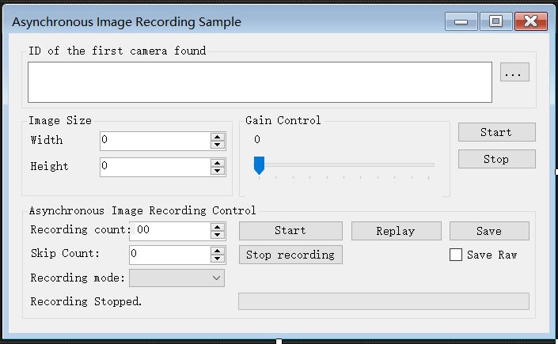

# 相机文档
---

### 相机程序逻辑


- 运行相机程序，会出现相机程序的gui，如图：


- **Recording count**变量的框设置为数值1，因为我们每次只需拍一张图片，用作python程序的输入
来处理图片

- 点击**Start**开始拍照，拍照的流程如下：
    - 判断是否启动相机实例，只有存在实例的情况下进入`while`循环，进行照片的获取、记录和保存
	- 在`while`循环中，
	

```cs
private void startCaptureButton_Click(object sender, EventArgs e);
``` 
这个函数是相机gui里**Start**按钮对应的事件函数，也是我们需要点击操作来启动相机程序。当启动相机程
序后，就不需要对其进行任何操作了。
 

