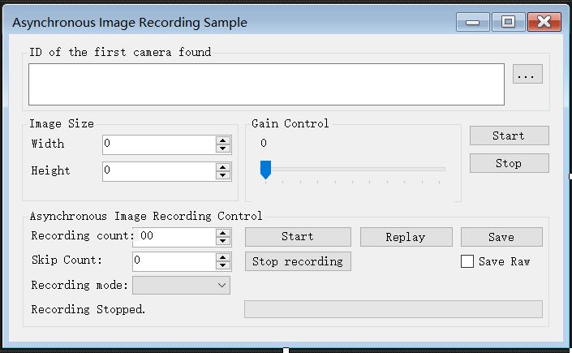

# 相机文档
---

### 相机程序逻辑


- 运行相机程序，会出现相机程序的gui，如图：



- **Recording count**变量的框设置为数值1，因为我们每次只需拍一张图片，用作python程序的输入来处理图片。

- 点击**Start**开始拍照，拍照的流程如下：
    - 判断是否启动相机实例，只有存在实例的情况下进入`while`循环，进行照片的获取、记录和保存。
	- 在`while`循环中，首先判断相机是否已经在记录当中且已经记录了至少一张图片，如果为真的话则停止记录，清除缓存，再打开相机记录；为假的话则直接打开相机记录。
	- 接着延迟200ms，处理所有的当前在消息队列中的Windows消息。
	- 再次判断相机是否已经在记录或者至少记录了一张图片，为真时进入以下流程：从缓冲区获取已记录的照片的列表，将照片保留，清除缓存，释放已分配内存。
	- 接着再一次停止记录，关掉图片获取，打开图片获取（此时已执行完`while`循环内的内容）。
	
- 由于每次存的图片命名是相同的，每次新图片会强制覆盖旧图片，而机械臂收回到相机范围外停留时间远大于每次拍照时间，所以python处理的最新图片不会有机械臂的影响


```cs
private void startCaptureButton_Click(object sender, EventArgs e);
``` 
这个函数是相机gui里**Start**按钮对应的事件函数，也是我们需要点击操作来启动相机程序。当启动相机程序后，就不需要对其进行任何操作了。
 
`StartAsyncImageRecording` 开始图片记录的函数

`StartImageAcquisition` 开始图片获取的函数（调用后并未写入内存）

`StopAcquisition` 停止获取图片的函数

### 核心代码

```cs
        private void startCaptureButton_Click(object sender, EventArgs e)
        {
            while (myCamera != null)
            {
                if (myCamera.IsAsyncImageRecordingRunning || (myCamera.TotalAsyncImagesRecordedCount > 0))
                {
                    myCamera.StopAsyncImageRecording();
                    myCamera.FreeAsyncRecordedImages();
                    myCamera.StartAsyncImageRecording(Convert.ToInt32(captureCountNumericUpDown.Value), (CCamera.AsyncImageRecordingMode)recordingModeComboBox.SelectedIndex, Convert.ToInt32(skipCountNumericUpDown.Value));
                }
                else
                {
                    myCamera.StartAsyncImageRecording(Convert.ToInt32(captureCountNumericUpDown.Value), (CCamera.AsyncImageRecordingMode)recordingModeComboBox.SelectedIndex, Convert.ToInt32(skipCountNumericUpDown.Value));
                }
              
                Delay(200);

                Application.DoEvents();
                if (!myCamera.IsAsyncImageRecordingRunning && (myCamera.TotalAsyncImagesRecordedCount > 0))
                {
                    // Prompt the user if he wants to continue or not with the image save
                    // if (MessageBox.Show(this, "Image save might take long time!\nAre you sure you want to continue?", "Image Save", MessageBoxButtons.OKCancel, MessageBoxIcon.Question, MessageBoxDefaultButton.Button1) == DialogResult.OK)
                    // {
                    // Disable the Image Recording buttons as long as we are saving the images
                    //asynchImageRecordingGroupBox.Enabled = false;

                    // Get the recorded images as a list
                    List<Jai_FactoryWrapper.ImageInfo> imageList = myCamera.GetAsyncRecordedImages();

                    // Any images recorded?

                    if (imageList != null && (imageList.Count > 0))
                    {
                        // Run through the list of recorded images
                        int index = myCamera.TotalAsyncImagesRecordedCount - 1;
                        Jai_FactoryWrapper.EFactoryError error = Jai_FactoryWrapper.EFactoryError.Success;

                        // Get the recorded image at this index
                        Jai_FactoryWrapper.ImageInfo ii = imageList[index];

                        // Are we saving the images in "raw" format or in Tiff?

                        // Create local image that will contain the converted image
                        Jai_FactoryWrapper.ImageInfo localImageInfo = new Jai_FactoryWrapper.ImageInfo();

                        // Allocate buffer that will contain the converted image
                        // In this sample we re-allocate the buffer over-and-over because we assume that the recorded images could be
                        // of different size (If we have been using the Sequence functionality in the cameras)
                        error = Jai_FactoryWrapper.J_Image_Malloc(ref ii, ref localImageInfo);

                        // Convert the raw image to image format
                        error = Jai_FactoryWrapper.J_Image_FromRawToImage(ref ii, ref localImageInfo, 4096, 4096, 4096);

                        // Save the image to disks
                        error = Jai_FactoryWrapper.J_Image_SaveFile(ref localImageInfo, "..\\" + "phone.png");

                        //error = Jai_FactoryWrapper.J_Image_SaveFile(ref localImageInfo, "C:\\Users\\aida\\Desktop\\wechat_jump\\" + "phone.png");

                        //Free the conversion buffer
                        error = Jai_FactoryWrapper.J_Image_Free(ref localImageInfo);

                        Application.DoEvents();

                    }
                    myCamera.StopAsyncImageRecording();
                    myCamera.StopImageAcquisition();
                    myCamera.StartImageAcquisition(true, 5);
                   
                    // Re-enable the Image Recording buttons
                    //asynchImageRecordingGroupBox.Enabled = true;
                    //}
                }
            }
        }
```